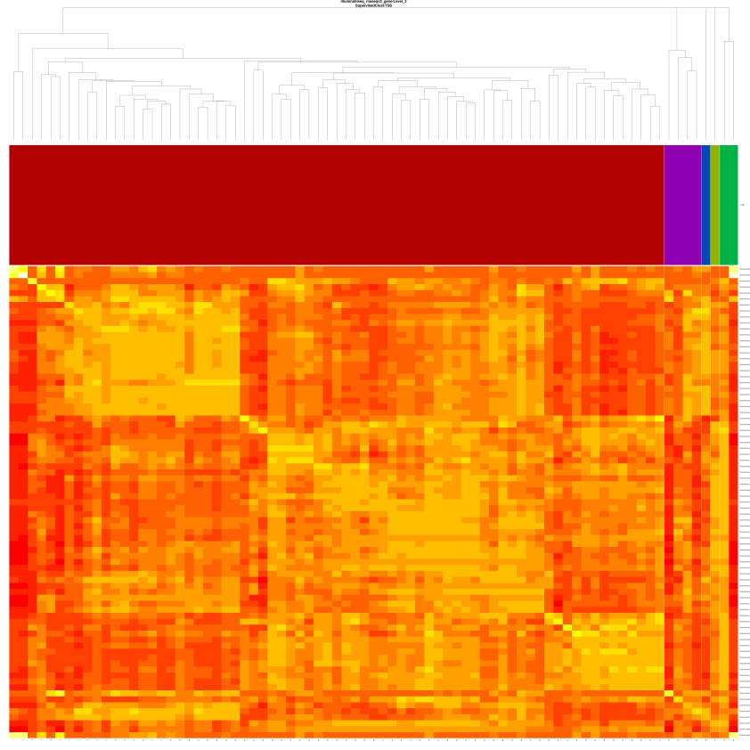

# Introduction

These instructions are aimed at people familiar with R and familiar with TCGA/GDC platforms and data types. They are intended to introduce the reader to producing the given assessment. These instructions will only rarely, if ever, touch on the appropriateness of the assessment algorithm or interpretation of output. See MBatch_01_InstallLinux for instructions on downloading test data.

# Algorithm

SupervisedClustering_Pairs_Structures is a function used to perform batch effects assessments using the supervised clustering algorithm for each pair of batch types provided.

# Output

The primary output method for MBatch is to view results in the Batch Effects Website, described elsewhere. The PNG files are rough versions of the website output.

Graphical output is a heatmap of the correlation values, topped by a covariate bar with the batch information, and at the top dendrograms for the clustering. The columns are batch values for a single batch type. The rows are sample ids.



# Usage

SupervisedClustering_Pairs_Structures(theData, theTitle, theOutputPath,
theListOfBatchPairs,
theBatchTypeAndValuePairsToRemove=list(),
theBatchTypeAndValuePairsToKeep=list() )

# Arguments

##theData
An instance of BEA_DATA.

BEA_DATA objects can be created by calls of the form new("BEA_DATA", theData, theBatches, theCovariates). If you have no covariate data, use an empty data.frame created with data.frame()

mData:
Object of class "matrix" A matrix where the colnames are sample ids and the rownames are gene equivalents. All names should be strings, not factors.

mBatches:
Object of class "data.frame" A data.frame where the column "names" are batch types. The first batch "type" is "Sample". All names and values should be strings, not factors or numeric.

mCovariates:
Object of class "data.frame" A data.frame where the column "names" are covariate types. The first covariate "type" is "Sample". All names and values should be strings, not factors or numeric.

##theTitle
A string title to use in PNG files.

##theOutputPath
String giving directory in which to place output PNG files.

##theListOfBatchPairs	
A vector of strings, where pairs of strings give batch types to use for pairs
assessment.

##theBatchTypeAndValuePairsToRemove
A list of vectors containing the batch type (or * for all types)
and the value to remove. list() indicates none while NULL will cause an error.

##theBatchTypeAndValuePairsToKeep
A list of vectors containing the batch type (or * for all types)
and a vector of the the value(s) to keep. list() indicates none while NULL
will cause an error.

# Example Call

The following code is adapted from the tests/SupervisedClustering_Pairs_Structures file. Data used is from the testing data as per the MBatch_01_InstallLinux document. In the future, we plan to make the output from MBatch more user friendly, but currently, this produces the following output at the command line.

This output can generally be skipped as very long and generally obscure.
After the output is an explanation of files and directories created.

```{r, echo=TRUE}
{
  require(MBatch)

  inputDir <- getTestInputDir()
  outputDir <- getTestOutputDir()
  compareDir <- getTestCompareDir()

  # set the paths
  theGeneFile=cleanFilePath(inputDir, "matrix_data-Tumor.tsv")
  theBatchFile=cleanFilePath(inputDir, "batches-Tumor.tsv")
  theOutputDir=cleanFilePath(outputDir, "SupervisedClustering_Pairs_Structures")
  theRandomSeed=314
  
  # make sure the output dir exists and is empty
  unlink(theOutputDir, recursive=TRUE)
  dir.create(theOutputDir, showWarnings=FALSE, recursive=TRUE)

  # load the data and reduce the amount of data to reduce run time
  myData <- mbatchLoadFiles(theGeneFile, theBatchFile)
  myData@mData <- mbatchTrimData(myData@mData, 100000)

  # here, we take most defaults
  SupervisedClustering_Pairs_Structures(theData=myData, 
    theTitle="Test Data Title", 
    theOutputPath=theOutputDir,
    theListOfBatchPairs=c("PlateId", "TSS", "BatchId", "TSS"),
    theBatchTypeAndValuePairsToRemove=list(),
    theBatchTypeAndValuePairsToKeep=list() )
}
```

# Example File Output

The above code creates the following subdirectories and files. The subdirectories correspond to the Batch Type Pairs on which assessments were requested.

```bash
/output/SupervisedClustering_Pairs_Structures$ ls -l
total 8
drwxr-xr-x 2 linux linux 4096 Jun 14 12:56 BatchId-TSS
drwxr-xr-x 2 linux linux 4096 Jun 14 12:56 PlateId-TSS
```

Looking at the "BatchId-TSS" subdirectory, it contains the following diagram and legend files.
This algorithm does not currently generate data usable with dynamic displays.

```bash
/output/SupervisedClustering_Pairs_Structures/BatchId-TSS$ ls -l
total 276
-rw-r--r-- 1 linux linux 261168 Jun 19 09:58 SupervisedClust_Diagram.png
-rw-r--r-- 1 linux linux   2701 Jun 19 09:58 SupervisedClust_Legend-BatchId.png
-rw-r--r-- 1 linux linux  12899 Jun 19 09:58 SupervisedClust_Legend-TSS.png
```

Here is the diagram generated from this code.

`r sprintf("", cleanFilePath(cleanFilePath(theOutputDir, "BatchId-TSS"), "SupervisedClust_Diagram.png"))`
